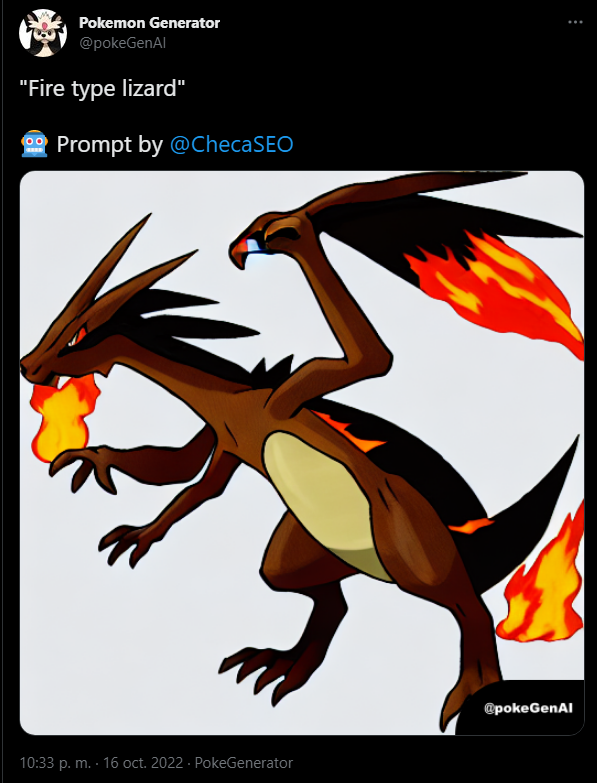

# Twitter-Pokemon-Generator

Twitter bot that generates pokemons based on the users prompts that quote the account.

When a user post a tweet quoting the bot account followed by a text message, it generates a new post using the user message as prompt [for the Text-To-Pokemon model](https://github.com/LambdaLabsML/lambda-diffusers), and then the account post a new tweet using the generated Pokemon.

## Prerequistes

> NodeJs >= 15
> MongoDB >= 4

## Screenshots

Example of a generated Tweet:



Try it out at [@pokeGenAI](https://twitter.com/pokeGenAI)

## Installation

Create a new .env file based on env.default on the root folder and set up your credentials on it, then you are ready to launch the bot

```bash
  npm install
  npm start
```

### Env variables

| Environment Key     | Description                  | Sample Value                                               |
| ------------------- | ---------------------------- | ---------------------------------------------------------- |
| DDBB_HOST           | Host of the MongoDB          | Eg: localhost:27017                                        |
| DDBB_USER           | MongoDB username             | Left it empty if is not set                                |
| DDBB_PASS           | MongoDB user password        | Left it empty if is not set                                |
| DDBB_NAME           | Name of the MongoDB database | pokeGenAI                                                  |
| API_KEY             | Twitter consumer key         | (from [Twitter Developers](http://developer.twitter.com/)) |
| API_SECRET          | Twitter consumer secret      | (from [Twitter Developers](http://developer.twitter.com/)) |
| BEARER              | Twitter access token         | (from [Twitter Developers](http://developer.twitter.com/)) |
| ACCESS_TOKEN        | Twitter access secret        | (from [Twitter Developers](http://developer.twitter.com/)) |
| ACCESS_TOKEN_SECRET | Token of telegram bot        | (from [Twitter Developers](http://developer.twitter.com/)) |
| ACCOUNT_USERNAME    | Telegram chat ID             | The user name of your account (include the @)              |

## Contributing

Contributions are always welcome!

## Authors

-   [@Mcheca](https://github.com/MCheca)